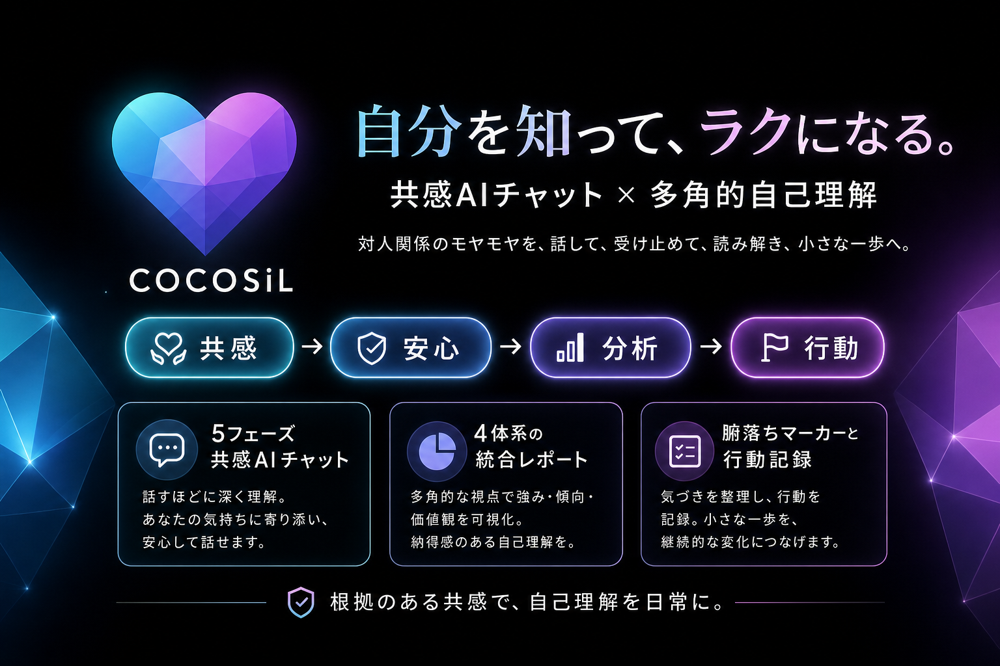

# COCOSiL V2

「自分を知って、ラクになる」  
共感AIチャット × 4体系パーソナリティ分析で、対人関係の繰り返しの消耗を解消する。



> **ミッション：** 東洋哲学が2500年追求した「自己認識による解放」をAIで民主化する。  
> **ターゲット：** 25-35歳の若手社会人。職場・恋愛・家族との関係で繰り返し消耗している層。  
> **PMF仮説：** 7日以内再訪率 30%以上。

### 設計中枢（Layer 0）— すべての判断の最上位基準

COCOSiLの機能・コピー・プロンプト判断はすべて**Why → How → So What**の三段論法に基づく：

| 層 | 根拠 | プロダクトへの応用 |
|---|---|---|
| **Why** | 無明（仏陀）/ 自知者明（老子） | 対人消耗の根源は「自己への無知」 |
| **How** | 三毒・五蘊・パンチャ構造・止観 | 4体系統合 = パンチャ構造の論理的必然 |
| **So What** | ハーバード成人発達研究（80年） | 自己理解は「良い人間関係」への入口 |

**設計3原則**: ① Dispel, Don't Decorate. ② From Reaction to Reflection. ③ Self-Knowing for Better-Relating.  
**詳細**: [設計中枢 v1.0](docs/input/concepts/COCOSiL設計中枢.md)

## 必要なツール

- Node.js 20+
- pnpm 10+（`npm install -g pnpm`）
- Supabase CLI（Homebrew: `brew install supabase/tap/supabase`）

## セットアップ

```bash
# 1. 環境変数を設定
cp .env.example .env.local
# .env.local を開き、Supabase の URL と Anon Key を記入

# 2. 依存関係をインストール
pnpm install

# 3. 開発サーバーを起動
pnpm dev
```

ブラウザで http://localhost:3000 を開く。

## 主要コマンド

| コマンド | 説明 |
|---|---|
| `pnpm dev` | 開発サーバー起動（Turbopack） |
| `pnpm build` | 本番ビルド |
| `pnpm lint` | ESLint 実行 |
| `supabase gen types typescript --local > lib/types/database.ts` | Supabase 型生成 |

## アーキテクチャメモ

- **`src/` ディレクトリは存在しない:** `@/*` はプロジェクトルート `./*` にマップされる（例: `@/lib/env`）
- **環境変数:** `lib/env.ts` で Zod バリデーション済み。アプリ内では `env` / `getServerEnv()` 経由で読む
- **Supabase 型:** 手書き禁止。`supabase gen types` で生成したファイルを `lib/types/database.ts` に配置

## ドキュメント

| ドキュメント | 内容 |
|---|---|
| [**設計中枢 v1.0**](docs/input/concepts/COCOSiL設計中枢.md) | **Layer 0 — 全判断の最上位基準。Why/How/So What・3原則・5問リトマス試験紙** |
| [コンセプト資料](docs/input/concepts/コンセプト資料.md) | プロダクト仕様・機能要件・DBスキーマ |
| [プロダクト概要](docs/input/concepts/overview-v2.md) | ミッション・ポジショニング・ターゲット詳細 |
| [リーンキャンバス](docs/input/concepts/lean-canvas-v3.md) | ビジネスモデル・KPI・料金プラン |
| [言語設計ガイド](docs/input/concepts/language-design-v1.md) | ブランドフレーズ・禁止語ルール |
| [アーキテクチャガイドライン](docs/input/concepts/antigravity_guideline_v2.md) | V2 設計方針 |
| [プラグイン構成](docs/input/setup/COCOSiL_plugin_setup.md) | Claude Code プラグイン・SKILL 設定 |

## 技術スタック

Next.js 16 (App Router) / React 19 / TypeScript 5 / Tailwind CSS 4 / Supabase / Clerk / OpenAI / Gamma API / Vercel / Zod 4 / pnpm
